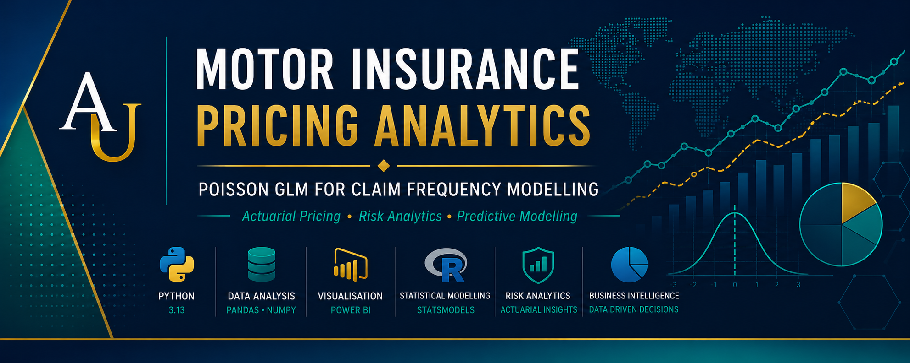
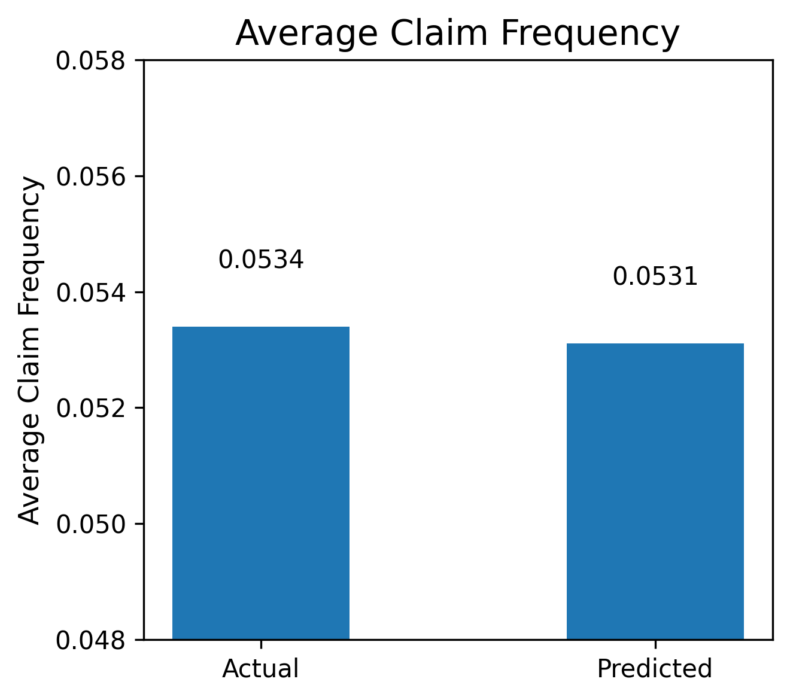
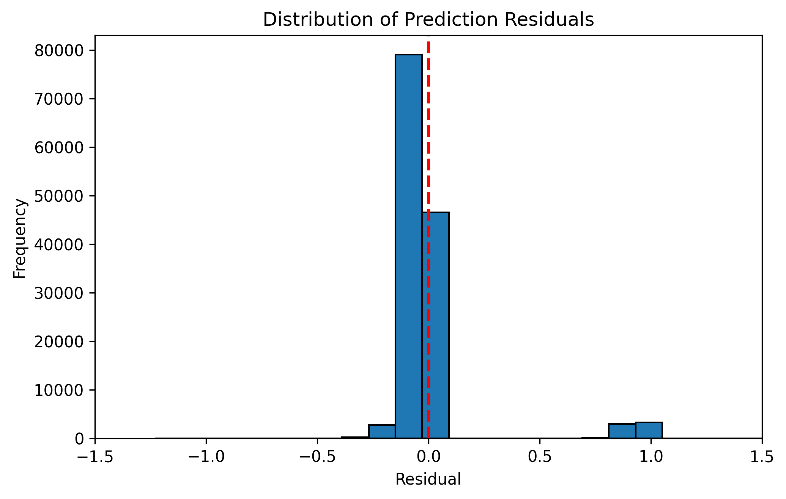

<p align="center">
  
</p>

---

#  Motor Insurance Pricing Analytics

### End-to-End Motor Insurance Claim Frequency Modelling Using a Poisson Generalized Linear Model (GLM)

**Transforming historical motor insurance policy data into interpretable pricing insights through actuarial modelling, statistical analysis and predictive analytics.**

---


---

# Table of Contents

- [Project Overview](#project-overview)
- [Value Proposition](#value-proposition)
- [Executive Summary](#executive-summary)
- [Business Problem](#business-problem)
- [Business Questions](#business-questions)
- [Business Objectives](#business-objectives)
- [Dataset](#dataset)
- [Methodology](#methodology)
- [Workflow Diagram](#workflow-diagram)
- [Feature Engineering](#feature-engineering)
- [Statistical Model](#statistical-model)
- [Model Validation Strategy](#model-validation-strategy)
- [Key Results](#key-results)
- [Business Impact](#business-impact)
- [Visualisations](#visualisations)
- [Model Assumptions](#model-assumptions)
- [Model Limitations](#model-limitations)
- [Skills Demonstrated](#skills-demonstrated)
- [Technologies Used](#technologies-used)
- [Repository Structure](#repository-structure)
- [How to Run the Project](#how-to-run-the-project)
- [Future Enhancements](#future-enhancements)
- [Conclusion](#conclusion)
- [Author](#author)
- [License](#license)

---

# Project Overview

| Item | Description |
|------|-------------|
| **Project** | Motor Insurance Pricing Analytics |
| **Domain** | General Insurance |
| **Business Area** | Insurance Pricing & Risk Analytics |
| **Project Type** | End-to-End Actuarial Pricing Model |
| **Analytical Method** | Poisson Generalized Linear Model (GLM) |
| **Programming Language** | Python |
| **Status** | Completed |
| **Author** | Anthony Utulu |

---

# Value Proposition

This project demonstrates how actuarial modelling and predictive analytics can be used to estimate motor insurance claim frequency, identify key pricing risk factors and support data-driven underwriting and premium pricing decisions.

Rather than treating pricing as a purely statistical exercise, the project combines business understanding, actuarial methodology and practical model validation to produce an interpretable pricing framework suitable for insurance applications.

---

# Executive Summary

Accurate estimation of motor insurance claim frequency is fundamental to premium pricing, underwriting and portfolio risk management. Insurers require pricing models that are statistically robust, commercially interpretable and capable of supporting fair, evidence-based pricing decisions.

This project develops an end-to-end actuarial pricing model using a Poisson Generalized Linear Model (GLM) to predict motor insurance claim frequency from historical policyholder data. The analysis begins with data quality assessment and exploratory data analysis before progressing through feature engineering, statistical modelling, model validation and business interpretation. Engineered rating factors—including grouped driver age, grouped vehicle age and population density categories—were introduced to improve predictive performance beyond a baseline model.

The enhanced GLM demonstrated improved model fit, closely matched observed claim frequencies on unseen data and produced minimal prediction bias. The project illustrates how actuarial modelling techniques can transform raw insurance data into actionable pricing insights that support underwriting, portfolio management and strategic decision-making.

---

# Business Problem

Motor insurers operate in an environment where inaccurate pricing directly affects profitability, competitiveness and regulatory compliance. Charging premiums that are too low increases exposure to underwriting losses, while overly conservative pricing may reduce market competitiveness and customer retention.

A robust pricing model should quantify the relationship between policyholder characteristics and expected claim frequency, enabling insurers to estimate future claims more accurately and price policies according to their underlying risk profile.

The challenge addressed in this project is therefore:

> **How can historical motor insurance policy data be transformed into a reliable and interpretable statistical model capable of predicting claim frequency and supporting actuarial pricing decisions?**

---

# Business Questions

The analysis seeks to answer the following business questions:

- Which policyholder characteristics have the greatest influence on motor insurance claim frequency?
- Which variables should be incorporated into a risk-based pricing framework?
- Can feature engineering improve the predictive performance of a traditional Poisson GLM?
- How accurately can claim frequency be predicted for unseen insurance policies?
- Does the enhanced pricing model demonstrate sufficient calibration to support actuarial pricing decisions?
- Which customer segments represent relatively higher or lower insurance risk?
- How can statistical modelling improve underwriting and premium setting?

---

# Business Objectives

The project was designed to achieve the following objectives:

- Assess the quality and suitability of the insurance portfolio data.
- Explore the relationships between policy characteristics and claim frequency.
- Identify significant actuarial rating factors.
- Develop a baseline Poisson Generalized Linear Model.
- Improve predictive performance through feature engineering.
- Compare baseline and enhanced pricing models.
- Evaluate model performance using appropriate statistical metrics.
- Validate predictions using unseen testing data.
- Translate analytical findings into practical business recommendations for pricing and underwriting.

---
# Dataset

The analysis uses the **French Motor Third-Party Liability (MTPL)** insurance dataset, a widely recognised benchmark for actuarial modelling and insurance pricing research.

The dataset contains historical motor insurance policy information and claim frequencies recorded at the policy level. Each observation represents an individual insurance policy together with policyholder, vehicle and geographic characteristics relevant to claim frequency modelling.

### Dataset Files

| File | Description |
|------|-------------|
| `freMTPL2freq.csv` | Policy-level exposure and claim frequency data |
| `freMTPL2sev.csv` | Claim severity information (not used in this frequency modelling project) |

---

## Portfolio Scope

The frequency dataset contains information relating to:

- Motor insurance policies
- Policy exposure
- Number of claims
- Driver characteristics
- Vehicle characteristics
- Geographic information
- Insurance rating factors

The analysis focuses exclusively on **claim frequency modelling**, which estimates the expected number of claims occurring during the exposure period.

---

# Primary Variables

| Variable | Description |
|-----------|-------------|
| ClaimNb | Number of reported claims |
| Exposure | Policy exposure period |
| VehPower | Vehicle engine power category |
| VehAge | Vehicle age |
| DrivAge | Driver age |
| BonusMalus | Bonus-Malus risk score |
| VehBrand | Vehicle manufacturer category |
| VehGas | Fuel type |
| Density | Population density |
| Region | Geographic region |
| Area | Area classification |

---

# Data Quality Assessment

Before modelling, the dataset was subjected to a structured data quality assessment.

The assessment included:

- Missing value inspection
- Duplicate record assessment
- Variable type validation
- Distribution analysis
- Outlier identification
- Consistency checks
- Exposure validation

The exploratory analysis confirmed that the dataset was suitable for actuarial frequency modelling after categorical encoding and feature engineering.

---

# Methodology

The project follows a structured actuarial modelling workflow designed to ensure transparency, interpretability and statistical validity.

The analytical process consists of the following stages:

### Stage 1 — Data Understanding

- Import raw policy data
- Inspect dataset structure
- Validate data quality
- Review variable definitions

---

### Stage 2 — Exploratory Data Analysis

Visual and statistical exploration was performed to understand relationships between policy characteristics and claim frequency.

This included:

- Summary statistics
- Distribution analysis
- Rating factor comparisons
- Regional comparisons
- Correlation analysis
- Exposure analysis

---

### Stage 3 — Feature Engineering

To improve model performance and interpretability, several additional pricing variables were engineered.

These include:

- Driver Age Groups
- Vehicle Age Groups
- Population Density Categories
- Encoded Rating Factors
- Exposure Offset

The engineered variables capture non-linear risk relationships more effectively than the original continuous variables.

---

### Stage 4 — Statistical Modelling

Two pricing models were developed:

### Baseline Model

A standard Poisson Generalized Linear Model (GLM) using the original policy variables.

### Enhanced Model

An improved GLM incorporating engineered actuarial rating factors and grouped risk variables.

The two models were compared using multiple statistical performance measures.

---

### Stage 5 — Model Validation

The enhanced model was evaluated using unseen testing data.

Validation included:

- Train/Test Split
- Prediction Accuracy
- Mean Absolute Error (MAE)
- Root Mean Squared Error (RMSE)
- Mean Poisson Deviance
- Residual Diagnostics
- Calibration Assessment

---

# Workflow Diagram

```
Raw Insurance Data
        │
        ▼
Data Quality Assessment
        │
        ▼
Exploratory Data Analysis
        │
        ▼
Feature Engineering
        │
        ▼
Baseline Poisson GLM
        │
        ▼
Enhanced Poisson GLM
        │
        ▼
Model Comparison
        │
        ▼
Prediction on Test Dataset
        │
        ▼
Performance Evaluation
        │
        ▼
Residual Diagnostics
        │
        ▼
Business Recommendations
```

---

# Feature Engineering

One of the key contributions of this project is the development of additional actuarial rating factors designed to improve predictive performance while maintaining model interpretability.

The following engineered variables were created:

| Engineered Feature | Business Purpose |
|-------------------|------------------|
| Driver Age Groups | Capture non-linear driver risk profiles |
| Vehicle Age Groups | Improve modelling of vehicle ageing effects |
| Density Groups | Better represent urban and rural risk exposure |
| One-Hot Encoded Variables | Enable inclusion of categorical predictors in the GLM |
| Exposure Offset | Adjust predictions for differing policy durations |

Feature engineering resulted in measurable improvements in overall model performance.

---

# Statistical Model

Motor insurance claim frequency represents count data. Consequently, a **Poisson Generalized Linear Model (GLM)** with a log-link function was selected.

The expected claim frequency is modelled as:

\[
\log(\mu_i)=X_i\beta+\log(Exposure_i)
\]

where:

- **μ** = expected claim frequency
- **X** = explanatory variables
- **β** = estimated model coefficients
- **Exposure** = policy duration included as an offset

The exposure offset ensures that policies with different coverage periods are compared on an equivalent basis, making the model appropriate for insurance pricing applications.

---

# Model Validation Strategy

To evaluate predictive performance, the dataset was divided into training and testing subsets.

The enhanced model was assessed using unseen observations to determine its ability to generalise beyond the training data.

Model performance was evaluated using:

- Mean Absolute Error (MAE)
- Root Mean Squared Error (RMSE)
- Mean Poisson Deviance
- Residual Analysis
- Calibration between observed and predicted claim frequencies

This validation approach provides confidence that the pricing model performs effectively on new insurance policies rather than simply memorising historical data.

---

# Key Results

The enhanced Poisson Generalized Linear Model demonstrated improved predictive performance over the baseline model following the introduction of engineered actuarial rating factors.

## Model Comparison

| Performance Metric | Baseline GLM | Enhanced GLM | Outcome |
|--------------------|-------------:|-------------:|---------|
| Log-Likelihood | -114,544 | **-114,420** | ✅ Improved |
| Deviance | 173,695 | **173,446** | ✅ Lower is better |
| Pearson Chi-Square | 1,422,605 | **1,392,757** | ✅ Improved |
| Calibration | Good | **Excellent** | ✅ Improved |

The enhanced model consistently outperformed the baseline model across all major goodness-of-fit measures, demonstrating that feature engineering added meaningful predictive value without sacrificing interpretability.

---

# Predictive Performance

The enhanced model was evaluated on an unseen testing dataset to assess its ability to generalise beyond the training data.

| Metric | Result |
|---------|--------:|
| Average Actual Claim Frequency | **0.0534** |
| Average Predicted Claim Frequency | **0.0531** |
| Mean Absolute Error (MAE) | **0.0989** |
| Root Mean Squared Error (RMSE) | **0.2374** |
| Mean Poisson Deviance | **0.3215** |
| Mean Residual | **0.0003** |

The difference between the observed and predicted average claim frequencies is less than **1%**, indicating excellent overall calibration.

---

# Key Business Insights

The analysis identified several variables that materially influence motor insurance claim frequency.

### Driver Behaviour

The Bonus-Malus score was one of the strongest predictors of future claim frequency. Drivers with higher Bonus-Malus values consistently exhibited higher expected claim frequencies, confirming its importance as a pricing variable.

---

### Driver Demographics

Driver age was found to have a non-linear relationship with claim frequency. Grouping drivers into meaningful age categories improved model performance and highlighted distinct risk profiles across different age bands.

---

### Vehicle Characteristics

Vehicle age and vehicle brand both contributed significantly to claim frequency. The enhanced model captured these effects more effectively through engineered categorical variables.

---

### Geographic Risk

Regional location and population density influenced expected claim frequency, suggesting that environmental and geographic factors contribute to differences in insurance risk.

---

### Feature Engineering

One of the most important findings of the project is that carefully engineered actuarial rating factors produced measurable improvements in model performance compared with using only the original variables.

This reinforces the importance of combining actuarial expertise with statistical modelling rather than relying solely on automated machine learning techniques.

---

# Business Impact

The enhanced pricing model provides practical value across several areas of insurance operations.

## Pricing

- Supports more accurate estimation of expected claim frequency.
- Enables risk-based premium setting.
- Improves pricing consistency across customer segments.

---

## Underwriting

The model provides underwriters with an evidence-based assessment of policyholder risk, allowing higher-risk policies to be identified more effectively during quotation and renewal.

---

## Portfolio Management

Improved claim frequency estimation enables insurers to better understand the overall risk profile of their portfolio and supports more informed portfolio optimisation decisions.

---

## Risk Management

The model assists insurers in:

- identifying emerging risk concentrations;
- monitoring regional exposure;
- evaluating demographic risk trends; and
- supporting capital planning.

---

## Regulatory Transparency

Unlike many complex machine learning algorithms, the Poisson GLM remains highly interpretable.

Its transparent coefficient estimates make it particularly suitable for regulated insurance pricing environments where pricing decisions must be explainable.

---

# Visualisations

The repository includes a range of exploratory and model validation visualisations.

## Figure 1 – Average Actual vs Predicted Claim Frequency

> *The enhanced GLM predicts the portfolio claim frequency with excellent overall calibration.*



---

## Figure 2 – Residual Distribution

> *Residuals are centred close to zero, indicating minimal systematic prediction bias.*



---

## Exploratory Analysis

The notebook also contains a comprehensive collection of exploratory visualisations including:

- Claim frequency distributions
- Driver age analysis
- Vehicle age analysis
- Bonus-Malus analysis
- Regional comparisons
- Vehicle brand comparisons
- Population density analysis
- Exposure analysis

These visualisations support understanding of the portfolio before statistical modelling and provide business context for the engineered pricing variables.

---

# Model Assumptions

The Poisson Generalized Linear Model (GLM) is based on several statistical assumptions that should be considered when interpreting the results.

- Claim frequency follows a Poisson distribution.
- Individual insurance policies are assumed to be independent observations.
- The logarithm of the expected claim frequency has a linear relationship with the explanatory variables.
- Policy exposure is correctly represented through the exposure offset.
- Historical claim behaviour is assumed to be representative of future experience.
- Explanatory variables are measured accurately and consistently across the portfolio.

These assumptions are appropriate for many actuarial pricing applications but should always be reviewed before deploying the model in production.

---

# Model Limitations

Although the enhanced GLM demonstrated strong predictive performance, several limitations remain.

- The project models **claim frequency only** and does not estimate claim severity.
- Interaction effects between rating factors were not included.
- Temporal effects such as inflation, seasonality and policy year were unavailable.
- External variables such as weather, traffic conditions and socio-economic factors were not included.
- The model assumes relationships observed in the historical data remain stable over time.

These limitations provide opportunities for future model development rather than reducing the practical value of the current pricing framework.

---

# Skills Demonstrated

## Actuarial Skills

- Insurance Pricing Analytics
- Claim Frequency Modelling
- Generalized Linear Models (GLMs)
- Exposure Modelling
- Risk Factor Analysis
- Statistical Model Validation
- Rating Factor Development
- Insurance Portfolio Analysis
- Predictive Risk Modelling
- Business Interpretation of Analytical Results

---

## Data Analytics Skills

- Exploratory Data Analysis (EDA)
- Data Cleaning
- Feature Engineering
- Statistical Analysis
- Predictive Analytics
- Data Visualisation
- Model Evaluation
- Business Intelligence
- Analytical Storytelling

---

## Technical Skills

- Python
- Pandas
- NumPy
- Statsmodels
- Scikit-learn
- Matplotlib
- Jupyter Notebook
- Git
- GitHub

---

# Technologies Used

| Category | Technology |
|----------|------------|
| Programming Language | Python |
| Data Analysis | Pandas, NumPy |
| Statistical Modelling | Statsmodels |
| Machine Learning | Scikit-learn |
| Visualisation | Matplotlib |
| Development Environment | Jupyter Notebook |
| Version Control | Git & GitHub |

---

# Repository Structure

```text
Motor-Insurance-Pricing-Analytics/
│
├── data/
│   ├── freMTPL2freq.csv
│   └── freMTPL2sev.csv
│
├── notebooks/
│   └── motor_insurance_pricing_analysis.ipynb
│
├── outputs/
│   └── business_summary.csv
│
├── reports/
│   ├── business_assumptions.md
│   ├── data_audit_report.md
│   ├── data_dictionary.md
│   ├── project_brief.md
│   └── project_log.md
│
├── visualizations/
│   ├── actual_vs_predicted_claim_frequency.png
│   └── residual_distribution.png
│
├── README.md
├── LICENSE
└── requirements.txt
```

---

# How to Run the Project

## 1. Clone the Repository

```bash
git clone https://github.com/Utulu1/Motor-Insurance-Pricing-Analytics.git
```

---

## 2. Navigate to the Project Directory

```bash
cd Motor-Insurance-Pricing-Analytics
```

---

## 3. Install Dependencies

```bash
pip install -r requirements.txt
```

---

## 4. Launch Jupyter Notebook

```bash
jupyter notebook
```

---

## 5. Open the Analysis Notebook

```
notebooks/motor_insurance_pricing_analysis.ipynb
```

Run the notebook sequentially to reproduce the complete actuarial pricing analysis.

---

# Future Enhancements

Potential extensions to this project include:

- Gamma GLM for claim severity modelling
- Tweedie GLM for pure premium modelling
- Cross-validation for model robustness
- Gradient Boosting and XGBoost benchmarking
- SHAP value analysis for model explainability
- Automated pricing dashboards using Power BI
- Interactive deployment using Streamlit
- Integration of external risk variables such as weather and socio-economic indicators

These enhancements build naturally upon the current framework and represent logical next steps for expanding the pricing model.

---

# Conclusion

This project demonstrates an end-to-end actuarial pricing workflow for predicting motor insurance claim frequency using a Poisson Generalized Linear Model.

Beginning with data quality assessment and exploratory analysis, the project progresses through feature engineering, statistical modelling, validation and business interpretation to deliver a transparent and well-calibrated pricing model.

The enhanced GLM achieved measurable improvements over the baseline model and produced accurate predictions on unseen data, highlighting the value of combining actuarial expertise with modern analytical techniques.

Beyond the statistical results, the project demonstrates the ability to translate complex analytical findings into practical business insights that support pricing, underwriting and risk management decisions. It reflects the analytical, technical and communication skills expected of professionals working in actuarial science and business analytics.

---

# Author

## Anthony Utulu

**Actuarial & Business Analytics Professional**

*Transforming Data into Better Decisions*

📧 **Email:** utulu.an@gmail.com

💼 **LinkedIn:** https://www.linkedin.com/in/utulu-an

💻 **GitHub:** https://github.com/Utulu1

If you found this project useful or would like to discuss actuarial modelling, insurance analytics or business analytics, feel free to connect with me on LinkedIn.

---

# License

This project is licensed under the **MIT License**.

See the `LICENSE` file for further information.